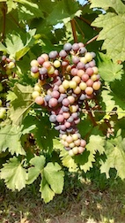

I am a PhD candidate in Biotechnology at the University of Verona. Officially. But I prefer to consider myself as a newbie in everything. This means that I am very curious and I love to discover new things. This makes it almost impossible for me to become expert in a specific field. Well, I think nowdays it is almost impossible for everyone to be an expert in a field, given how fast new "things" are created, produced, discovered.
Apart from the romanticisms, I like life sciences and as a PhD candidate in Biotechnology (plant genetics) my project aims at **the identification of the genes involved in the regulation of flowering and veraison in grapevine**. Veraison is that stage of berry development where the berries start to become soft and change color (from green to white/red).

The approaches I am following are mainly *in silico*; that means that I work most of the time at my laptop with genomic sequences, genetic polymorphisms and phenotypic data. For the specialists, this is a genetic association study (i.e. Genome-Wide Association Study **GWAS**, or Candidate-Gene Association Study). Some they consider me *Bioinformatician*, I prefer the term *Computational biologist*, since I trained as a biotechnologist and I had not informatic competences almost two years before now.
Recently I fall in love with **data** and ways to manipulate them. Since then I became interested in that wonderful world related to **R**, which is my daily working "language".